---
# You can also start simply with 'default'
theme: seriph
# random image from a curated Unsplash collection by Anthony
# like them? see https://unsplash.com/collections/94734566/slidev
background: https://cover.sli.dev
# some information about your slides (markdown enabled)
title: Welcome to the HTML
info: |
  ## Slidev Starter Template
  Presentation slides for developers.

  Learn more at [Sli.dev](https://sli.dev)
# apply unocss classes to the current slide
class: text-center
# https://sli.dev/custom/highlighters.html
highlighter: shiki
# https://sli.dev/guide/drawing
drawings:
  persist: false
# slide transition: https://sli.dev/guide/animations#slide-transitions
transition: slide-left
# enable MDC Syntax: https://sli.dev/guide/syntax#mdc-syntax
mdc: true
---

# Welcome to the HTML

HTML stands for hypertext markup language

---

# Structure of a webpage

`structure of a skeleton systen is defined by bones whereas structure of a webpage is defined by tags`

# tags

`<keywords>`

Each tag is followed by some content and exactly same tag with additional forward slash.

`<h1> `  
 `Welcome to My Webpage`  
 `</h1>`

`The tag without forward slash is called opening tag and the tag with forward slash is called closing tag.And together with opening tag and closing tag with content is called html element.`

---

# Structure of HTML file.

<div class="grid grid-cols-2 gap-4">
<div>

````md magic-move {lines: true}
<!-- ```ts
``` -->

```ts
<html>
  |
  |
  |
</html>
```

```ts
<html>
       <head>
          ...
       </head>
       <body>
          │
          │
          │
       </body>
</html>
```

```ts
<html>
       <head>
          <title>My First Web Page</title>
       </head>
       <body>
          │
          │
          │
       </body>
</html>
```
````

</div>
<div>
<v-click>
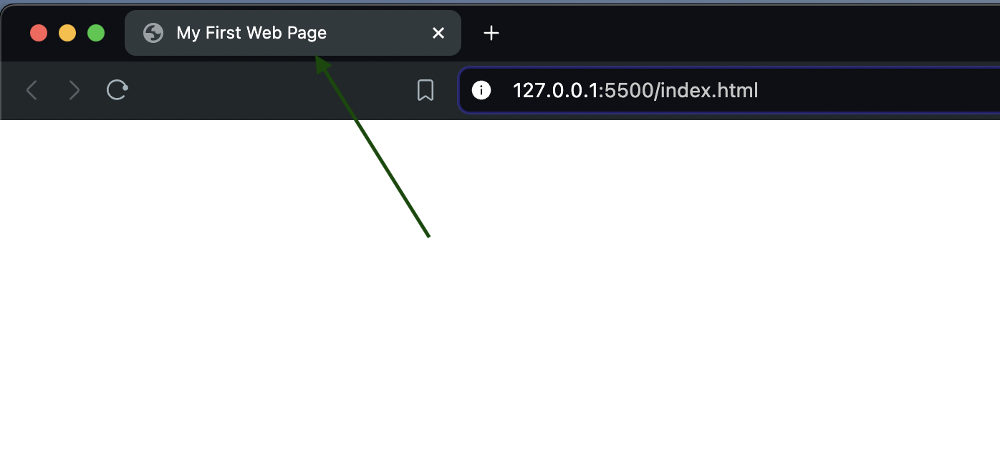

</v-click>

</div>
</div>
---

# First html code

<div class="grid grid-cols-2 gap-4">

<div>
```ts
<html>
  <head>
    <title>My First Web Page</title>
  </head>
  <body>
    <h1>Hello world</h1>
  </body>
</html>
```
</div>

<div>

<v-click>
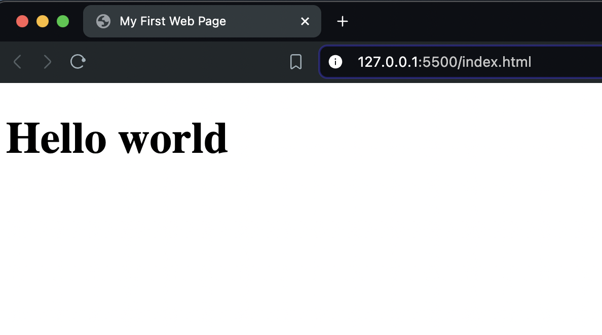
</v-click>

</div>

</div>

---

# Heading tag

<div class="grid grid-cols-2 gap-4">
<div>

````md magic-move {lines: true}
```html
<html>
  <head>
    <title>My First Web Page</title>
  </head>
  <body>
    <h1>Heading 1</h1>
  </body>
</html>
```

```html
<html>
  <head>
    <title>My First Web Page</title>
  </head>
  <body>
    <h1>Heading 1</h1>
    <h2>Heading 2</h2>
  </body>
</html>
```

```html
<html>
  <head>
    <title>My First Web Page</title>
  </head>
  <body>
    <h1>Heading 1</h1>
    <h2>Heading 2</h2>
    <h3>Heading 3</h3>
  </body>
</html>
```

```html
<html>
  <head>
    <title>My First Web Page</title>
  </head>
  <body>
    <h1>Heading 1</h1>
    <h2>Heading 2</h2>
    <h3>Heading 3</h3>
    <h4>Heading 4</h4>
  </body>
</html>
```

```html
<html>
  <head>
    <title>My First Web Page</title>
  </head>
  <body>
    <h1>Heading 1</h1>
    <h2>Heading 2</h2>
    <h3>Heading 3</h3>
    <h4>Heading 4</h4>
    <h5>Heading 5</h5>
    <h6>Heading 6</h6>
  </body>
</html>
```
````

</div>

<div>

<ImagesTransition :images="[
  'assets/heading_1.png',
  'assets/heading_2.png',
  'assets/heading_3.png',
  'assets/heading_4.png',
  'assets/heading_6.png'
]" />

</div>

</div>

---

# Structure of HTML file.

<div class="h-[400px] overflow-auto">

```html
<html>
  <head>
    <link rel="icon" href="Codeneur-logomark.png" />
    <title>My First Web Page</title>
  </head>
  <body>
    <h1>Heading 1</h1>
    <h2>Heading 2</h2>
    <h3>Heading 3</h3>
    <h4>Heading 4</h4>
    <h5>Heading 5</h5>
    <h6>Heading 6</h6>
    <p>
      Lorem ipsum dolor, sit amet consectetur adipisicing elit. Obcaecati quod
      harum aliquam amet ad autem, sit quis corrupti deserunt impedit veniam
      commodi. Necessitatibus, excepturi, non minima placeat repellendus quasi
      culpa voluptatem rem inventore, assumenda ratione numquam magni nobis modi
      fuga. Molestiae quidem itaque beatae a corrupti molestias veniam cumque
      earum quisquam labore totam recusandae, voluptate officiis deleniti, id
      ullam vitae consectetur aliquid aliquam amet ratione impedit tenetur! Amet
      dolores laboriosam nesciunt accusantium numquam praesentium nihil, ad
      maiores vel cum quaerat velit, excepturi architecto in quidem repudiandae
      suscipit hic optio facilis. Exercitationem minima odit ipsa repudiandae
      assumenda soluta quam blanditiis, laudantium adipisci voluptate molestias
      magni doloremque nostrum fugiat at facere veritatis et quaerat dignissimos
      reprehenderit mollitia nam iste! Alias molestiae ad excepturi atque
      maiores earum, at recusandae voluptatem aperiam fugiat eius corporis
      sapiente eos optio possimus ratione debitis. Error repellat voluptatem
      possimus sapiente itaque eos nemo porro voluptatum. Accusantium cupiditate
      delectus ex! Animi dolore sapiente totam delectus eaque quam minus velit,
      perferendis nemo obcaecati recusandae blanditiis dicta consectetur magni
      similique ab fugiat suscipit illo? Quos cupiditate debitis placeat dolor
      molestias perferendis. Aliquid illum laboriosam corporis a quidem aliquam
      deleniti praesentium error, quasi delectus et, voluptate soluta voluptatem
      fugiat dolor, maiores beatae.
    </p>
  </body>
</html>
```

</div>

---

# Text Formatting Tags in HTML

<v-click>
```html
<strong>
```
</v-click>

<v-click>
```html
<em>
```
</v-click>

<v-click>
```html
<br>
```
</v-click>

<v-click>
```html
<hr>
```
</v-click>
<v-click>
```html
<u>
```
</v-click>

<v-click>
```html
<s>
```
</v-click>

<v-click>
```html
<sub>
```
</v-click>

<v-click>
```html
<sup>
```
</v-click>

---

## strong tag

The `<strong>` tag is used in HTML to define text with strong importance.

<div class="grid grid-cols-2 gap-4">
<div>

```html
<html lang="en">
  <head>
    <link
      rel="icon"
      href="starting-presentation/assets/Codeneur-logomark.png"
    />
    <title>strong tag</title>
  </head>
  <body>
    <h1>This is H1</h1>
    <p>
      This is a normal sentence, but
      <strong>this part is very important</strong> and should stand out.
    </p>
  </body>
</html>
```

</div>

<div>

<v-click>
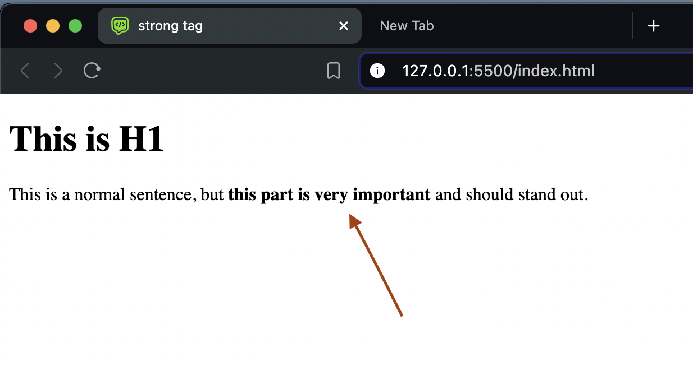
</v-click>

</div>

</div>

---

## em tag

The `<em>` tag is used to emphasize text, typically rendering it in italic. It indicates a slight emphasis compared to `<strong>` tag.

<div class="grid grid-cols-2 gap-4">
<div>

```html
<html lang="en">
  <head>
    <link
      rel="icon"
      href="starting-presentation/assets/Codeneur-logomark.png"
    />
    <title>em tag</title>
  </head>
  <body>
    <h1>This is H1</h1>
    <p>He emphasized the <em>importance</em> of learning HTML.</p>
  </body>
</html>
```

</div>

<div>

<v-click>
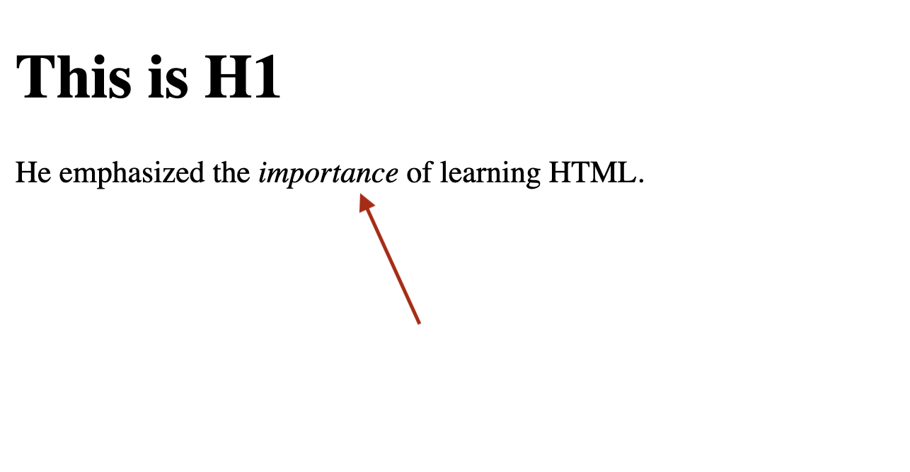
</v-click>

</div>

</div>

---

## br tag

The `<br>` tag is a line break tag that allows us to create a line break within text content. It is a self-closing tag and does not require a closing tag.

<div class="grid grid-cols-2 gap-4">
<div>

```html
<html lang="en">
  <head>
    <link
      rel="icon"
      href="starting-presentation/assets/Codeneur-logomark.png"
    />
    <title>br tag</title>
  </head>
  <body>
    <h1>This is H1</h1>
    <p>This text will<br />be split into two lines.</p>
  </body>
</html>
```

</div>

<div>

<v-click>
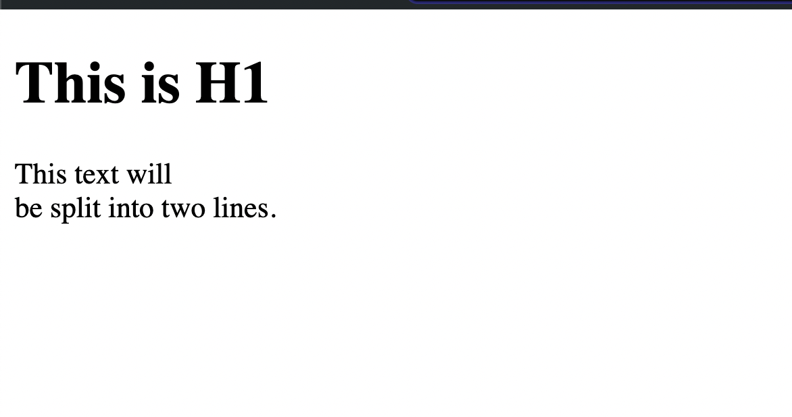
</v-click>

</div>

</div>

---

## hr tag

The `<hr>` tag is used to create a thematic break or horizontal rule between paragraphs. It is a self-closing tag and typically renders as a horizontal line across the page.

<div class="grid grid-cols-2 gap-4">
<div>

```html
<html lang="en">
  <head>
    <link
      rel="icon"
      href="starting-presentation/assets/Codeneur-logomark.png"
    />
    <title>hr tag</title>
  </head>
  <body>
    <h1>Understanding the hr Tag</h1>
    <p>Before the break</p>
    <hr />
    <p>After the break</p>
  </body>
</html>
```

</div>

<div>

<v-click>
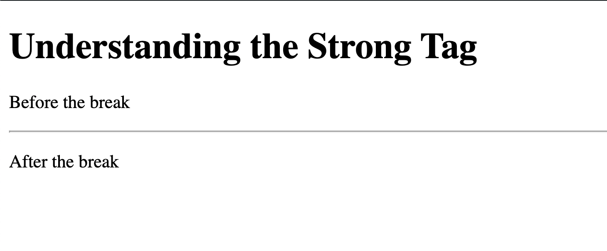
</v-click>

</div>

</div>

---

## s tag

The `<s>` tag is used to strikethrough text, indicating that it is no longer accurate or relevant. It is often used to denote deleted or old information.

<div class="grid grid-cols-2 gap-4">
<div>

```html
<html lang="en">
  <head>
    <link
      rel="icon"
      href="starting-presentation/assets/Codeneur-logomark.png"
    />
    <title>s tag</title>
  </head>
  <body>
    <h1>Understanding the s Tag</h1>
    <p><s>Old price: $50</s> New price: $40</p>
  </body>
</html>
```

</div>

<div>

<v-click>
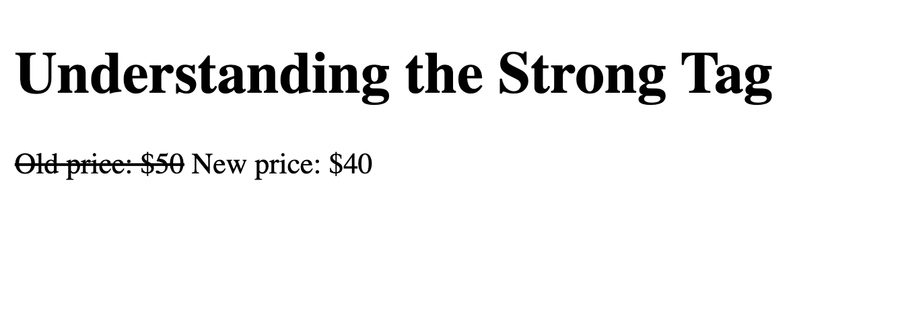
</v-click>

</div>

</div>

---

## sup tag

The `<sup>` tag is used to place text in superscript, typically for footnotes or mathematical expressions.

<div class="grid grid-cols-2 gap-4">
<div>

```html
<html lang="en">
  <head>
    <link
      rel="icon"
      href="starting-presentation/assets/Codeneur-logomark.png"
    />
    <title>sup tag</title>
  </head>
  <body>
    <h1>Understanding the sup Tag</h1>
    <p>E=mc<sup>2</sup> (where c is the speed of light).</p>
  </body>
</html>
```

</div>

<div>

<v-click>
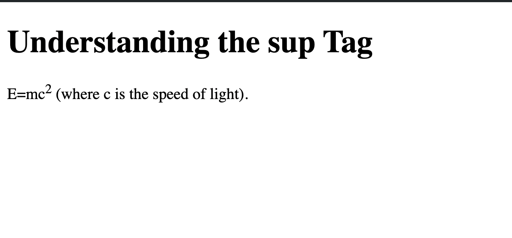
</v-click>

</div>

</div>

---

## sub tag

The `<sub>` tag is used to place text in subscript, often used in chemical formulas or mathematical expressions.

<div class="grid grid-cols-2 gap-4">
<div>

```html
<html lang="en">
  <head>
    <link
      rel="icon"
      href="starting-presentation/assets/Codeneur-logomark.png"
    />
    <title>sub tag</title>
  </head>
  <body>
    <h1>Understanding the sub Tag</h1>
    <p>H<sub>2</sub>O (water molecule).</p>
  </body>
</html>
```

</div>

<div>

<v-click>
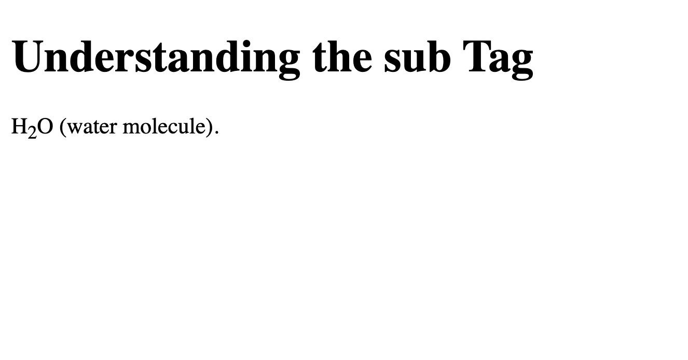
</v-click>

</div>

</div>

---

# Task

## Basic Structure:

``Add the ` declaration at the top of your file.

Set up the HTML structure with `<html>`, `<head>`, and `<body>` tags.

Inside the `<head>` section, include a `<title>` tag and set the title to "My First Web Page".``

## Heading Tags:

``Inside the `<body>`tag, add heading tags from`<h1>`to`<h6>`.

Each heading should contain the text "Heading 1", "Heading 2", etc.``

---

# Text Content and Paragraph:

## Add a Paragraph (`<p>` tag):

Below the heading tags, add a `<p>` tag.
Inside the `<p>` tag, insert 200 words of Lorem Ipsum text.

---

<div class="grid grid-cols-1 gap-4 h-[500px] overflow-auto">

# Text Formatting Tags:

### Strong Tag:

Modify the paragraph text to highlight the word "Lorem" using the `<strong>` tag.

### Emphasis Tag:

Use the `<em>` tag to italicize the word "vehicula" in the same paragraph.

### Line Break Tag:

Add a `<br>` tag after the word "elit" in the paragraph to break the line.

### Horizontal Rule Tag:

Add an `<hr>` tag after the paragraph to create a horizontal line separating the content.

### Strikethrough Tag:

Add a new paragraph below the `<hr>` tag with the text "Old Price: $50" and apply the `<s>` tag to strike through the text.

### Superscript Tag:

Below the strikethrough text, add a paragraph explaining Einstein's equation: "E=mc²". Use the `<sup>` tag to superscript the "2".

### Subscript Tag:

Below the superscript example, add another paragraph explaining the chemical formula for water: "H₂O". Use the `<sub>` tag to subscript the "2".

</div>

---

# HTML Fundamentals

<v-click>
```html
Lists
```
</v-click>

<v-click>
```html
Links
```
</v-click>

<v-click>
```html
Images
```
</v-click>

<v-click>
```html
Tables
```
</v-click>
<v-click>
```html
Forms
```
</v-click>

<v-click>
```html
nav
```
</v-click>

---

## Lists

Lists in HTML allow us to organize content into ordered and unordered lists.

<v-click>
```html
<ul> (Unordered List): Creates a bulleted list.
```
</v-click>

<v-click>
```html
<ol> (Ordered List): Creates a numbered list.
```
</v-click>

<!-- <v-click>
```html
<li> (List Item): Defines each item in a list.
```
</v-click> -->

---

# Unordered List

<div class="grid grid-cols-2 gap-4">

<div>

````md magic-move {lines: true}
```ts
<html lang="en">
       <head>
        <title>Unordered List</title>
       </head>
       <body>

       </body>

</html>
```

```ts
<html lang="en">
       <head>
        <title>Unordered List</title>
       </head>
       <body>
        <ul>

        </ul>
       </body>

</html>
```

```ts
<html lang="en">
       <head>
        <title>Unordered List</title>
       </head>
       <body>
        <ul>
              <li>Item 1</li>
              <li>Item 2</li>
              <li>Item 3</li>
        </ul>
       </body>
</html>
```
````

</div>

<div>

<v-click>
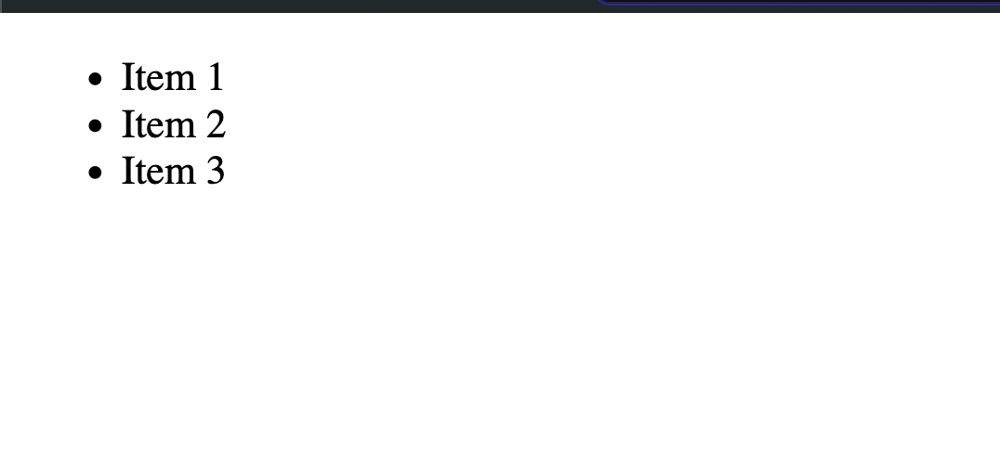
</v-click>

</div>

</div>

---

# Ordered List

<div class="grid grid-cols-2 gap-4">
<div>

````md magic-move {lines: true}
```ts
<html lang="en">
       <head>
        <title>Ordered List</title>
       </head>
       <body>

       </body>

</html>
```

```ts
<html lang="en">
       <head>
        <title>Ordered List</title>
       </head>
       <body>
        <ol>

        </ol>
       </body>

</html>
```

```ts
<html lang="en">
       <head>
        <title>Ordered List</title>
       </head>
       <body>
        <ol>
              <li>Item 1</li>
              <li>Item 2</li>
              <li>Item 3</li>
        </ol>
       </body>
</html>
```
````

</div>

<div>

<v-click>
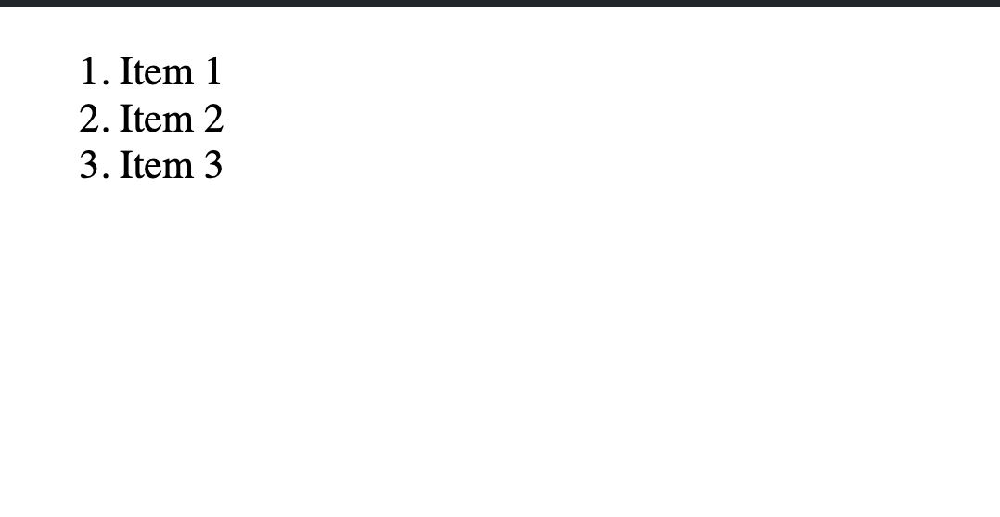
</v-click>

</div>

</div>

---

# Image Embedding

<div class="grid grid-cols-2 gap-4">
<div>

````md magic-move {lines: true}
```ts
<html lang="en">
       <head>
        <title>HTML Images</title>
       </head>
       <body>

       </body>
</html>
```

```ts
<html lang="en">
       <head>
        <title>HTML Images</title>
       </head>
       <body>
        
       </body>
</html>
```

```ts
<html lang="en">
       <head>
        <title>HTML Images</title>
       </head>
       <body>
        
       </body>
</html>
```

```ts
<html lang="en">
       <head>
        <title>HTML Images</title>
       </head>
       <body>
        
       </body>
</html>
```

```ts
<html lang="en">
       <head>
        <title>HTML Images</title>
       </head>
       <body>
        
       </body>
</html>
```
````

</div>

<div>

<v-click>

</v-click>

</div>

</div>

---

# Link

<div class="grid grid-cols-2 gap-4">
<div>

````md magic-move {lines: true}
```ts
<html lang="en">
       <head>
        <title>HTML Links</title>
       </head>
       <body>

       </body>
</html>
```

```ts
<html lang="en">
       <head>
        <title>HTML Links</title>
       </head>
       <body>
        <a>
          Visit Example.com
        </a>
       </body>
</html>
```

```ts
<html lang="en">
       <head>
        <title>HTML Links</title>
       </head>
       <body>
        <a href="https://www.example.com">
          Visit Example.com
        </a>
       </body>
</html>
```

```ts
<html lang="en">
       <head>
        <title>HTML Links</title>
       </head>
       <body>
        <a href="https://www.example.com">
          Visit Example.com
        </a>
       </body>
</html>
```
````

</div>

<div>

<v-click>
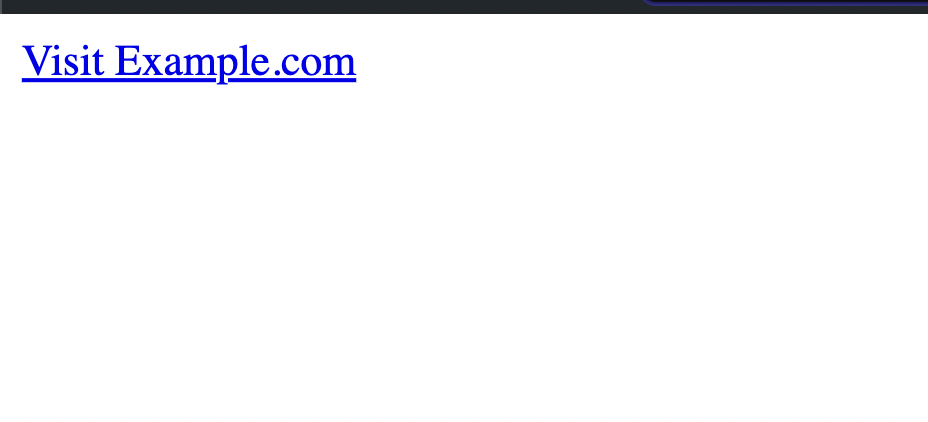
</v-click>

</div>

</div>

---

# Basic Table Structure

<div class="grid grid-cols-2 gap-4">
<div>

````md magic-move {lines: true}
```ts
<html lang="en">
       <head>
        <title>HTML Table Headers</title>
       </head>
       <body>
        <table>

        </table>
       </body>
</html>
```

```ts
<html lang="en">
       <head>
        <title>HTML Table Headers</title>
       </head>
       <body>
        <table>
          <thead>
          </thead>
        </table>
       </body>
</html>
```

```ts
<html lang="en">
       <head>
        <title>HTML Table Headers</title>
       </head>
       <body>
        <table>
        <thead>
          <tr>
          </tr>
          </thead>
        </table>
       </body>
</html>
```

```ts
<html lang="en">
       <head>
        <title>HTML Table Headers</title>
       </head>
       <body>
        <table>
        <thead>
          <tr>
            <th>Name</th>
            <th>Age</th>
            <th>Address</th>
          </tr>
          </thead>
        </table>
       </body>
</html>
```

```ts
<html lang="en">
       <head>
        <title>HTML Table Headers</title>
       </head>
       <body>
        <table>
        <thead>
          <tr>
            <th>Name</th>
            <th>Age</th>
            <th>Address</th>
          </tr>
          </thead>
          <tbody>
          </tbody>
        </table>
       </body>
</html>
```

```ts
<html lang="en">
       <head>
        <title>HTML Table Headers</title>
       </head>
       <body>
        <table>
        <thead>
          <tr>
            <th>Name</th>
            <th>Age</th>
            <th>Address</th>
          </tr>
          </thead>
          <tbody>
             <tr>
            </tr>
          </tbody>
        </table>
       </body>
</html>
```

```ts
<html lang="en">
       <head>
        <title>HTML Table Headers</title>
       </head>
       <body>
        <table>
        <thead>
          <tr>
            <th>Name</th>
            <th>Age</th>
            <th>Address</th>
          </tr>
          </thead>
          <tbody>
             <tr>
                <td>John</td>
                <td>30</td>
                <td>New York</td>
            </tr>
          </tbody>
        </table>
       </body>
</html>
```
````

</div>

<div>

<v-click>
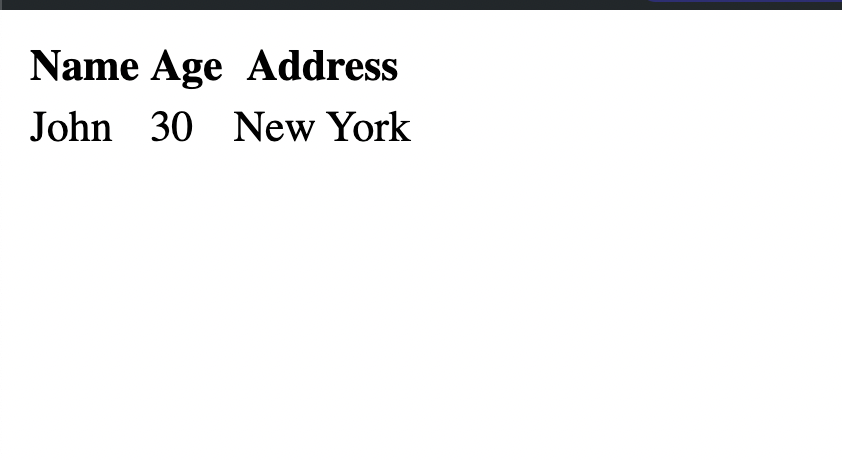
</v-click>

</div>

</div>

---

<div class="grid grid-cols-2 gap-4">
<div class="h-[500px] overflow-auto">

````md magic-move {lines: true}
```html
<html lang="en">
  <head>
    <title>HTML Table Headers</title>
  </head>
  <body>
    <table>
      <thead>
        <tr>
          <th>Name</th>
          <th>Age</th>
          <th>Address</th>
        </tr>
      </thead>
      <tbody>
        <tr>
          <td>John</td>
          <td>30</td>
          <td>New York</td>
        </tr>
        <tr>
          <td>Jane</td>
          <td>25</td>
          <td>Los Angeles</td>
        </tr>
        <tr>
          <td>Mike</td>
          <td>35</td>
          <td>Chicago</td>
        </tr>
      </tbody>
    </table>
  </body>
</html>
```
````

</div>

<div>

<v-click>

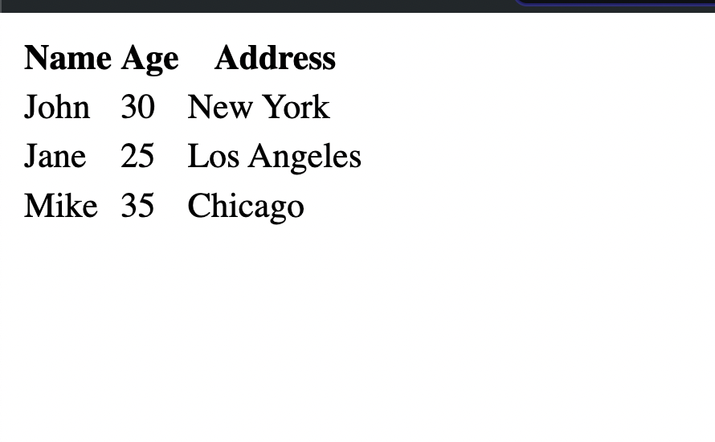

</v-click>

</div>

</div>

---

# Form

````md magic-move {lines: true}
```ts
<html lang="en">
       <head>
        <title>HTML Form Example</title>
       </head>
       <body>
        <form>
        </form>
       </body>
</html>
```

```ts
<html lang="en">
       <head>
        <title>HTML Form Example</title>
       </head>
       <body>
        <form>
          <label for="username">Username:</label>
          <input type="text" id="username" name="username" required>
        </form>
       </body>
</html>
```

```ts
<html lang="en">
       <head>
        <title>HTML Form Example</title>
       </head>
       <body>
        <form>
          <label for="username">Username:</label>
          <input type="text" id="username" name="username">
          <label for="email">Email:</label>
          <input type="email" id="email" name="email">
        </form>
       </body>
</html>
```

```ts
<!DOCTYPE html>
<html lang="en">
       <head>
        <title>HTML Form Example</title>
       </head>
       <body>
        <form>
          <label for="username">Username:</label>
          <input type="text" id="username" name="username">
          <label for="email">Email:</label><br>
          <input type="email" id="email" name="email">
          <label for="message">Message:</label>
          <textarea id="message" name="message" rows="4"></textarea>
        </form>
       </body>
</html>
```

```ts
<!DOCTYPE html>
<html lang="en">
       <head>
        <title>HTML Form Example</title>
       </head>
       <body>
        <form>
          <label for="username">Username:</label>
          <input type="text" id="username" name="username">
          <label for="email">Email:</label><br>
          <input type="email" id="email" name="email">
          <label for="message">Message:</label>
          <textarea id="message" name="message" rows="4"></textarea>
          <button type="submit">Submit</button>
        </form>
       </body>
</html>
```
````

---

# Semantic HTML Elements

<v-click>
```html
header
```
</v-click>

<v-click>
```html
nav
```
</v-click>

<v-click>
```html
main
```
</v-click>

<v-click>
```html
section
```
</v-click>
<v-click>
```html
aside
```
</v-click>

<v-click>
```html
footer
```
</v-click>

---

# HTML Sementic tags

````md magic-move {lines: true}
```ts
<!DOCTYPE html>
<html lang="en">
       <head>
        <title>Semantic HTML Example</title>
       </head>
       <body>
        <header>
        </header>
      </body>
</html>
```

```ts
<!DOCTYPE html>
<html lang="en">
       <head>
        <title>Semantic HTML Example</title>
       </head>
       <body>
          <header>
            <nav>
            </nav>
          </header>
      </body>
</html>
```

```ts
<!DOCTYPE html>
<html lang="en">
       <head>
        <title>Semantic HTML Example</title>
       </head>
       <body>
          <header>
            <nav>
              <ul>
              </ul>
            </nav>
          </header>
      </body>
</html>
```

```ts
<!DOCTYPE html>
<html lang="en">
       <head>
        <title>Semantic HTML Example</title>
       </head>
       <body>
          <header>
            <nav>
              <ul>
                <li>Home</li>
                <li>About</li>
                <li>Contact</li>
              </ul>
            </nav>
          </header>
      </body>
</html>
```

```ts
<!DOCTYPE html>
<html lang="en">
       <head>
        <title>Semantic HTML Example</title>
       </head>
       <body>
          <header>
            <nav>
              <ul>
                <li>Home</li>
                <li>About</li>
                <li>Contact</li>
              </ul>
            </nav>
          </header>
          <main>
          </main>
      </body>
</html>
```

```ts
<!DOCTYPE html>
<html lang="en">
       <head>
        <title>Semantic HTML Example</title>
       </head>
       <body>
          <header>
            <nav>
              <ul>
                <li>Home</li>
                <li>About</li>
                <li>Contact</li>
              </ul>
            </nav>
          </header>
          <main>
            <section>
            </section>
          </main>
      </body>
</html>
```

```ts
<!DOCTYPE html>
<html lang="en">
       <head>
        <title>Semantic HTML Example</title>
       </head>
       <body>
          <header>
            <nav>
              <ul>
                <li>Home</li>
                <li>About</li>
                <li>Contact</li>
              </ul>
            </nav>
          </header>
          <main>
            <section>
                    <aside>
                    </aside>
            </section>
          </main>
      </body>
</html>
```

```ts
<!DOCTYPE html>
<html lang="en">
       <head>
        <title>Semantic HTML Example</title>
       </head>
       <body>
          <header>
            <nav>
              <ul>
                <li>Home</li>
                <li>About</li>
                <li>Contact</li>
              </ul>
            </nav>
          </header>
          <main>
            <section>
                    <aside>
                      content
                    </aside>
            </section>
          </main>
      </body>
</html>
```

```ts
<!DOCTYPE html>
<html lang="en">
       <head>
        <title>Semantic HTML Example</title>
       </head>
       <body>
          <header>
           ...
          </header>
          <main>
            <section>
                    <aside>
                      content
                    </aside>
            </section>
            <footer>
            </footer>
          </main>
      </body>
</html>
```

```ts
<!DOCTYPE html>
<html lang="en">
       <head>
        <title>Semantic HTML Example</title>
       </head>
       <body>
          <header>
           ...
          </header>
          <main>
            <section>
                    <aside>
                      content
                    </aside>
            </section>
            <footer>
              <p>&copy; 2024 Company Name. All rights reserved.</p>
            </footer>
          </main>
      </body>
</html>
```

```ts
<!DOCTYPE html>
<html lang="en">
       <head>
        <title>Semantic HTML Example</title>
       </head>
       <body>
          <header>
           ...
          </header>
          <main>
            <section>
                    <aside>
                      content
                    </aside>
            </section>
            <footer>
              <p>&copy; 2024 Company Name. All rights reserved.</p>
                  <p>Connect with us:</p>
                  <ul class="social-links">
                    <li><a href="https://twitter.com/example" target="_blank">Twitter</a></li>
                    <li><a href="https://facebook.com/example" target="_blank">Facebook</a></li>
                    <li><a href="https://instagram.com/example" target="_blank">Instagram</a></li>
                  </ul>
            </footer>
          </main>
      </body>
</html>
```
````

---

# Non-semantic tags.

## HTML - Grouping Using `div` and `span`

- Grouping allows us to organize content into sections.

---

## The `<div>` Element

- Stands for "division" or "section".

<v-click>

## Example Usage of `<div>`

```html
<div>
  <h2>Section Title</h2>
  <p>This is a paragraph inside a div.</p>
</div>
```

</v-click>

---

# HTML - Grouping Using `span`

- Used to group smaller chunks of text or inline elements.

## Example Usage of `<span>`

```html
<p>This is a <span>highlighted</span> word in a sentence.</p>
```

---

<div class="h-[500px] overflow-auto" >

Create an HTML document that demonstrates your understanding of various HTML elements and structure. Follow these requirements:

### Basic Structure:

Use the correct DOCTYPE declaration.

Add a title to your page: "My HTML Practice"

### Header Section:

Create a header with a nav bar.

Include an unordered list in the nav bar with at least 3 items (Home, About, Contact).

### Main Content:

Use the `<main>` tag to wrap your main content.

Create at least two `<section>` elements within the main content.

### Text Formatting:

Use all heading tags from `<h1>` to `<h6>`.

Create paragraphs using the `<p>` tag.

</div>
